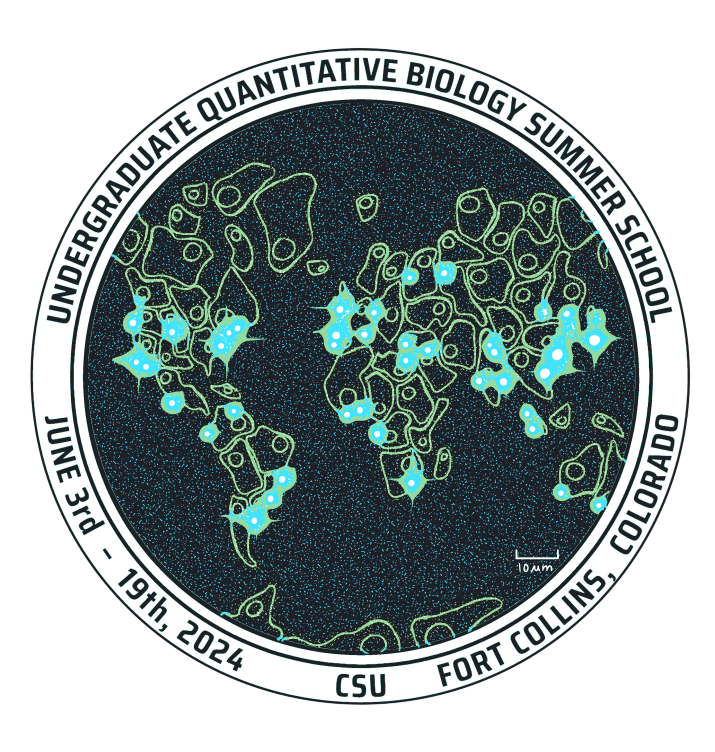
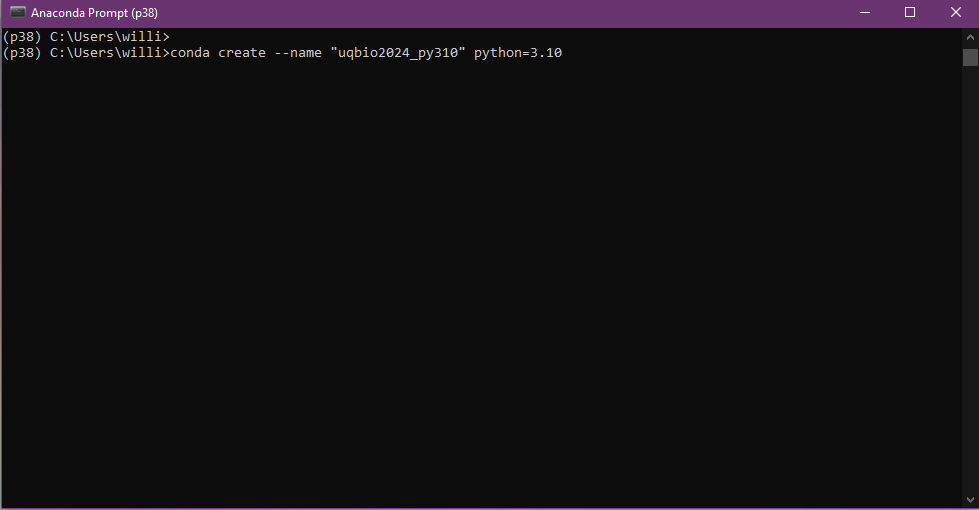
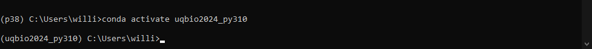
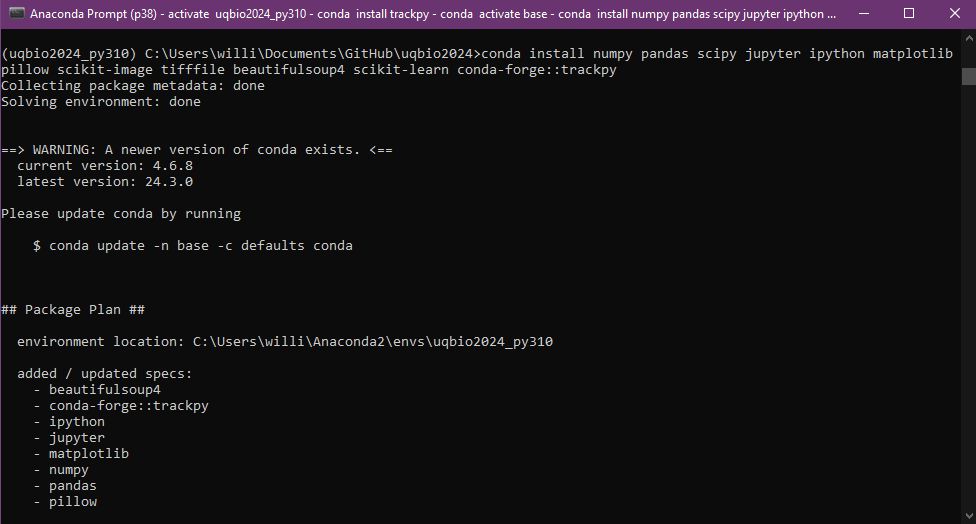
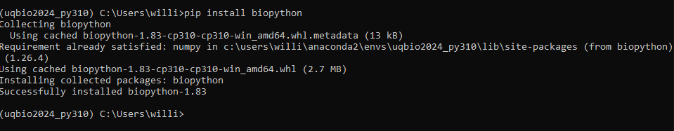
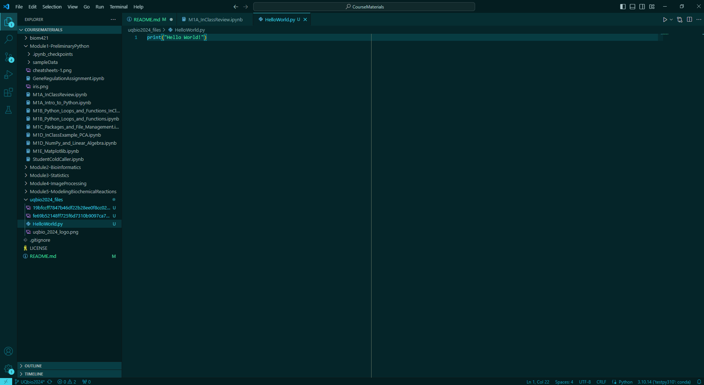
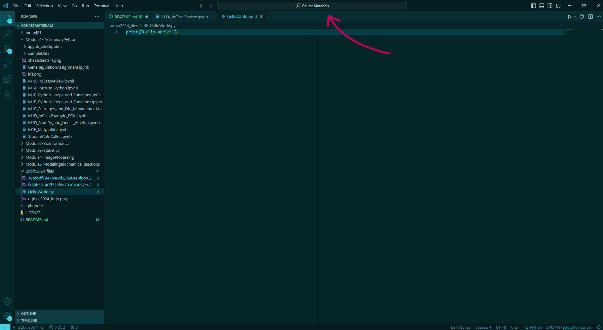
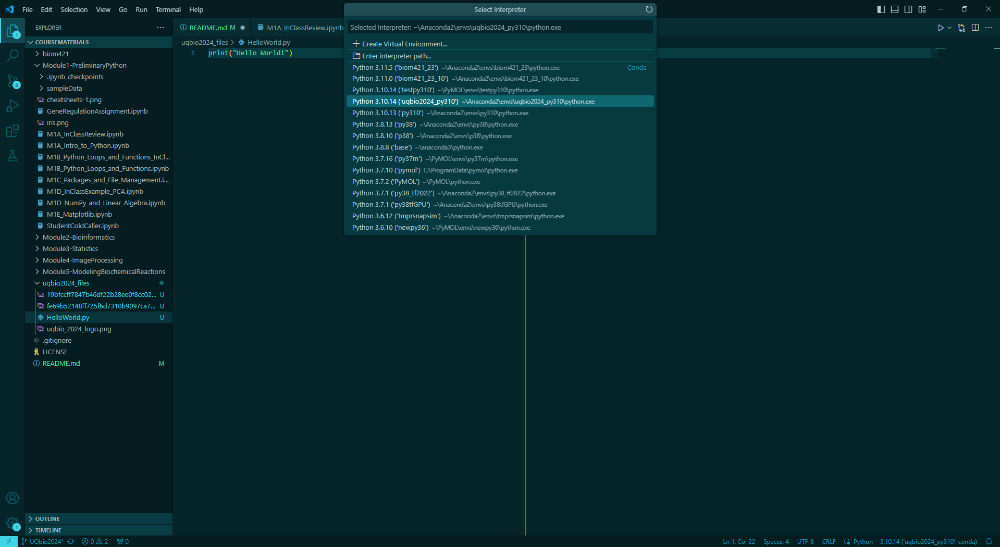
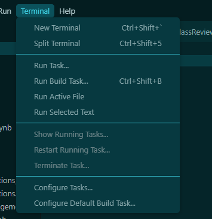
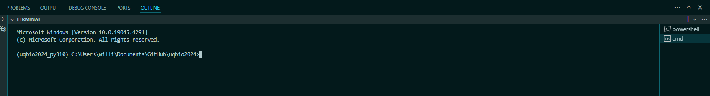

<html>
<h1> <left> Welcome to UQ-BIO Summer School 2024! </left> </h1>
        
         <div> <p></p> </div>
         <div style="font-size: 20px; width: 1000px;">
              <p><left==========================================left> </p>
              <p> Below is the GitHub repository holding all the links to Jupyter Notebooks and files needed during the course and instructions on installing Python.</p>
           <h3> Authors: </h3> 
           <pre> 
Brian Munsky, Luis Aguilera, 
Alex Popinga, Keisha Cook, Kaan  Öcal,
William Raymond, Zachary Fox, 
Eric Ron, and Dmitri Svetlov
           </pre>
<p><a href = "mailto: uqbio.summer.school@gmail.com"> uqbio.summer.school@gmail.com </a> • <a href="https://q-bio.org/wp/uq-bio-schedule-2024/">2024 Undergraduate Summer School Schedule</a>  • <a href="https://q-bio.org/wp/">UQ-Bio</a> •  <a href="https://www.engr.colostate.edu/~munsky/">Munsky Group</a> </p>
</div>
</p>
</html>

- [Course Materials](#course-materials)
- [Python Setup](#python-setup)
  - [Installing Anaconda or Miniconda](#installing-anaconda-or-miniconda)
  - [Creating an Environment](#creating-an-environment)
  - [Using your new environment in VS Code](#using-your-new-environment-in-vs-code)
  - [Learning Python resources](#learning-python-resources)
- [Getting Started with GitHub](#getting-started-with-github)
  - [Helpful GitHub Tutorials:](#helpful-github-tutorials)
- [Licensing](#licensing)


## Course Materials

Below are the course materials for the 2024 UQ-Bio Summer School.  Please pull to refresh this repository often as these materials may change at any time up to the actual lecture date!  Please note that the six suggested homework assignments cover multiple topics. To complete these assigments follow the provided links, clone the repository and commit and push your work to be graded.

<left><h3> Module 1 : Getting Started with Basic Scientific Computing in Python. </h3></left>
| Date (MST) | Description | Links to Notebook(s) | Links to Homework |
| --------| -------- | -------- | -------- |
| Before May 29th | Hello (Python) world, types, arithmetic operations, iterables, and containers  | [Module 1A ➡️](./Module1-PreliminaryPython/M1A_Intro_to_Python.ipynb) | [HW1 ➡️](https://classroom.github.com/a/yS9Z4pH7)
| Before May 29th | Loops, Ranges, Functions, Lambdas | [Module 1B ➡️](./Module1-PreliminaryPython/M1B_Python_Loops_and_Functions.ipynb) | [HW2 ➡️](https://classroom.github.com/a/myCW-1RM)
| Before May 29th | Importing packages, classes/modules, os navigation, file managment basics  | [Module 1C ➡️](./Module1-PreliminaryPython/M1C_Packages_and_File_Management.ipynb) | [HW3 ➡️](https://classroom.github.com/a/e0NugNFT)
| Before May 29th | NumPy and linear algebra review in Python | [Module 1D ➡️](./Module1-PreliminaryPython/M1D_NumPy_and_Linear_Algebra.ipynb) | [HW2 ➡️](https://classroom.github.com/a/myCW-1RM)
| Before May 29th | Visualizing biological data using Matplotlib | [Module 1E ➡️](./Module1-PreliminaryPython/M1E_Matplotlib.ipynb) | [HW3 ➡️](https://classroom.github.com/a/e0NugNFT)
___

<left><h3> Module 2 : Optical Microscopy Experiments and Image Processing. </h3></left>
| Date (MST)  | Description |Instructor | Notebook(s)  | Homework |
| -------- | -------- | -------- | -------- | -------- |
| June 4  | Image Loading and Processing | Dr. Luis Aguilera | [M2A - Basics ➡️](./Module2-ImageProcessing/M2A_Basic_Image_Processing.ipynb)   | [HW4 ➡️](https://classroom.github.com/a/hToo3Prt) |   | 
| June 5 | Image Segmentation and Particle Tracking  | Dr. Luis Aguilera | [M2B-Segmentation ➡️](./Module2-ImageProcessing/M2B_Segmenting_Images.ipynb) [M2C-Particle Tracking ➡️](./ImageProcessing/M2C_Tracking_Particles.ipynb) [Afternoon Practice](./Module2-ImageProcessing/M2D_Processing_Handwrtten_Digits.ipynb) | [HW4 ➡️](https://classroom.github.com/a/hToo3Prt) |
___

<left><h3> Module 3 :  Multivariable Statistics and Machine Learning for Biological Data.  </h3></left>
| Date (MST)  | Description |Instructor | Notebook(s)  | Homework |
| -------- | -------- | -------- | -------- | -------- |
| June 6 | Statistics | Dr. Keisha Cook | <ul>[M3A-Distributions ➡️](./Module3-Statistics/M3A_Distributions_Sampling_Expectations_and_SummaryStatistics.ipynb)  </ul><ul>[M3B-Likelihoods ➡️](./Module3-Statistics/M3B_LikelihoodFunctions_Estimation.ipynb) </ul><ul>[M3C-Significance ➡️](./Module3-Statistics/M3C_HypothesisTesting_Significance_Pvalues.ipynb) </ul> | [HW5 ➡️](https://classroom.github.com/a/4UURF--W)
| June 7 | Introduction to Machine Learning for Biological Data | Dr. William Raymond  |  <ul>[M3D-Regression ➡️](./Module3-Statistics/M3D_Intro_to_ML_and_Basics_of_Regression.ipynb)</ul> <ul>[M3E-Basic Classification ➡️](./Module3-Statistics/M3E_Basics_of_Classification.ipynb)</ul>    | [HW5 ➡️](https://classroom.github.com/a/4UURF--W)
___


<left><h3> Module 4 :  Computational Modeling and Stochastic Simulation of Biological Processes. </h3></left>
| Date (MST) | Description | Instructor | Notebook(s)  | Homework |
| --------| -------- | -------- | -------- | -------- |
| June 11 | Stoichiometries, Propensity functions, and ODE Models | Connor King | [M4A-Stoichiometries and Propentsities➡️](./Module4-ModelingBiochemicalReactions/M4A_Stoichiometries_Propensities_and_ODE_Models.ipynb)| [HW6 ➡️](https://classroom.github.com/a/tLyhxyma)
| June 12 | Stochastic Simulation | Jack Forman and Alex David  | [M4B-Stochasitic Simulation ➡️](./Module4-ModelingBiochemicalReactions/M4B_Stochastic_Simulation_Algorithm.ipynb) | [HW6 ➡️](https://classroom.github.com/a/tLyhxyma)
| June 13 | Chemical Master Equation and the Finite State Projection| Dr. Alex Popinga | [M4C-Chemical Master Equations ➡️](./Module4-ModelingBiochemicalReactions/M4C_Chemical_Master_Equation.ipynb)| [HW6 ➡️](https://classroom.github.com/a/tLyhxyma)
___

<left><h3> Module 5 :  Markov Chain Monte Carlo (MCMC) Methods and Model Inference. </h3></left>
| Date (MST) | Description | Instructor | Notebook(s)  | Homework |
| --------| -------- | -------- | -------- | -------- |
| June 14 | Python Tutorial for MCMC | Dr. Kaan Ocal |   <ul>[M5A-Bayesian Thinking ➡️](./Module5-BayesianThinkingAndMCMC/M5A_Bayesian_Thinking.ipynb)</ul> <ul>[M5B-MCMC ➡️](./Module5-BayesianThinkingAndMCMC/M5B_Markov_Chain_Monte_Carlo.ipynb)</ul>    |  [HW6 ➡️](https://classroom.github.com/a/tLyhxyma)
___

## Python Setup 

### Installing Anaconda or Miniconda

First we need an environment manager! Using an environment manager is good practice when doing coding projects as it lets you setup seperate coding environments and kernels for different tasks. 

Download and install either anaconda or miniconda from:  https://www.anaconda.com/download. Anaconda includes more packages and features that come with it but is around 5 gigabytes to install. Miniconda installs just the bare necessities and is 400 mb. For our purposes either works.

### Creating an Environment

Once you have conda installed, we need to create a new environment for the class. 

* Restart your computer so conda is available.
* Open up a new Terminal (Linux/Mac) or Anaconda Prompt / Command Prompt (Windows) and type the following commands
   1. ```conda activate```  - after activating you will see (base) in front of your prompt, this is the current conda environment you are in. 

   2. ```conda create --name "uqbio2024_py310" python=3.10``` 
   

   3. ```conda activate uqbio2024_py310```
    you should see your current environment switch to (uqbio2024_py310)

   4. ```conda install numpy pandas scipy jupyter ipython matplotlib pillow scikit-image seaborn tifffile beautifulsoup4 scikit-learn conda-forge::trackpy```
   
      * Note this command will take a while and will ask for your confirmation!

   5. ```pip install biopython```
   

   7. Last thing to install is ```cellpose``` which is a little involved and requires ```pytorch```. 
      * For **GPU** acceleration, you need an nvidia graphics card and a CUDAtoolkit to check these go to the following website: https://pytorch.org/get-started/locally/ and run the command given there for your system. PLEASE REMOVE ```torchvision``` and ```torchaudio``` from the command! This will save you time and space as we are not using those packages. After CUDA and ```torch``` are installed, run the following command to install cellpose: ```pip install git+https://www.github.com/mouseland/cellpose.git```
      * For CPU if you do not have an nvidia graphics card, just run the following: ```pip install git+https://www.github.com/mouseland/cellpose.git```
   7. Finally check your environment is working correctly by running the ```check_environment.py``` file in this repository. Navigate to the directory where your local repository is and run: ```python check_environment.py```. If there are no error messages then you are good to go!


### Using your new environment in VS Code

Now that we have a brand new environment, we can use an IDE (integrated developing environment) to use this Python environment for Python coding. For this course we recommend VS Code: https://code.visualstudio.com/

1. Open VS Code

   * Optional: Make a new workspace under File > Workspace to your CourseMaterials folder

2. Enter the search bar and type ">" or use "Ctrl + Shift + P" for activating the command palette


3. type Python: Select interpreter and select the uqbio2024_py310 kernel


5. At the top, click Terminal and then New terminal or use "Ctrl + Shift + `"


6. Check that the terminal that popped up is using our correct environment by making sure it says ```(uqbio2024_py310)``` in front of your path name in the terminal or command prompt.


Feel free to check out the preliminary python notebooks under CourseMaterials/Module1-PreliminaryPython/. To run a notebook file in VS Code, simply open the .ipynb file in VS code by navigating to it in your workspace or using File > Open File.

### Learning Python resources

Python 3.10 documentation's tutorial: https://docs.python.org/3.10/tutorial/index.html


## Getting Started with GitHub

We are going to use and share a lot of codes during the summer school, and it can be difficult to keep track of who is working on what.  To help us with this common concern, we are going to use GitHub for version control. 

This is also how course homework can be submitted and graded throughout the program, so if you want fast feedback, it is very important for you to learn how to use GitHub!

Please follow these steps to get started using GitHub (and to complete your first homework assignment):

**Step 1** Visit [https://github.com/](https://github.com/) and sign up for a free account. Keep track of your user name and password, and you may need to set up two-factor identification. Follow instructions to do so.

**Step 2** Once you have a GitHub account, go to Homework 1 (GitHub Introduction) at [https://classroom.github.com/a/OhptcG8t](https://classroom.github.com/a/OhptcG8t) to get access to your first UQ-Bio Summer School Homework Assignment. This will take you to a signup sheet for the class. 

**Step 3** Look for your name in the list and click to claim your spot. If you are not yet listed, click "skip to the next step" (also make sure you signed up for the class at: [https://forms.gle/ux67KhtV7Q3pDgrZ8](https://forms.gle/ux67KhtV7Q3pDgrZ8). Refresh a few times until your repository is created and then follow the links.

**Step 4** Once the repository is ready, a link will appear: "https://github.com/MunskyGroup/uqbio2024_github-[YOURNAME])," where [YOURNAME] is replaced with your GitHub userID.  Follow this link to your own personal repository to see your first assignment.

**Step 5** If you are not an expert on GitHub already, I recommend using the GitHub Desktop Client for performing necessary GitHub tasks. Download this at: [https://desktop.github.com](https://desktop.github.com).

**Step 6** Once you have installed GitHub Desktop, launch it, and it will ask you to sign in as a GitHub user (use your account from Step 1).

**Step 7** You will reach a page titled "Let's get started". Click the button "clone a repository" on the second from the top on the left. Type your repository name ("MunskyGroup/uqbio2024_github-[YOURNAME]")
Click the button "Clone" at the bottom.

If all went well, you should now be able to follow along with our class exercises and be able to complete the first part of the first homework assignment.


### Helpful GitHub Tutorials:
Tutorial on getting started in GitHub Desktop: [GitHub Desktop Tutorial](https://docs.github.com/en/desktop/overview/getting-started-with-github-desktop)

Suggestions for editors to use for modifying your README file:
* You can edit the readme directly in VSCode.
* Windows users should be able to edit the README in Notepad++, which should be automatically installed.
* Mac users should be able to edit it in TextEdit, which should come pre-installed.
* You can also edit readme directly on the GitHub page, which is what I usually do.

[Slides discussing Git and GitHub philosophy and best practices](uqbio2024_files/GitAndGitHubPresentation_2024UQ-BioSummerSchool.pdf)

Cheatsheet with GitHub Commands: [github-git-cheatsheet.pdf](https://education.github.com/git-cheat-sheet-education.pdf)


[](https://www.youtube.com/watch?v=MrPRz1_4euA)

## Licensing

[](https://opensource.org/licenses/BSD-3-Clause)
